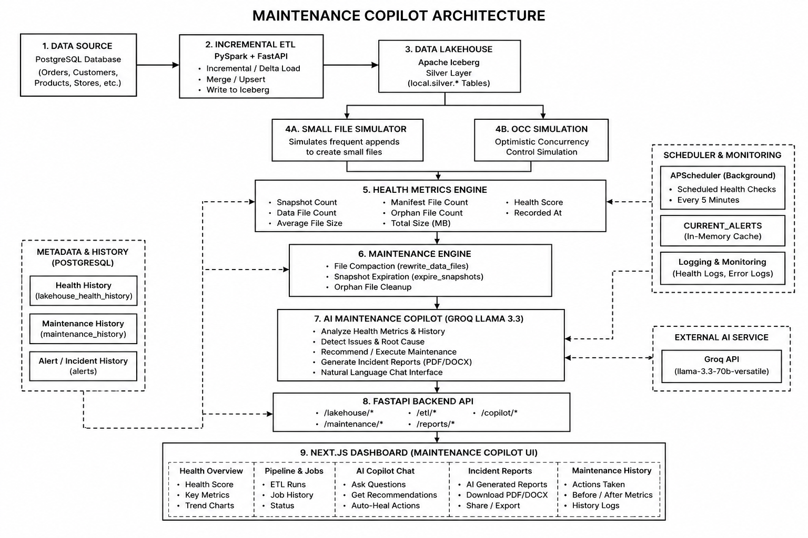

# 🏔️ Lakehouse Maintenance Copilot

## 📌 Project Overview

Lakehouse Maintenance Copilot is a complete data engineering project built to demonstrate how a modern Lakehouse can automatically monitor its health, detect problems, perform maintenance, and provide AI-powered recommendations.

The project simulates a real-world data pipeline where data is continuously loaded from a PostgreSQL database into Apache Iceberg tables using Apache Spark. Over time, this creates common Lakehouse problems such as small files, increasing snapshots, and metadata growth.

Instead of requiring a data engineer to manually monitor these issues, the Lakehouse Maintenance Copilot continuously checks the health of the tables, detects problems, recommends maintenance actions, performs maintenance operations, and generates AI-powered incident reports.

The project also includes an Optimistic Concurrency Control (OCC) simulation to demonstrate how Apache Iceberg safely handles concurrent writes from multiple Spark sessions.

---

# 🎯 Objectives

The main objectives of this project are:

* Build an end-to-end Lakehouse ETL pipeline
* Perform Incremental ETL using Apache Spark
* Store data in Apache Iceberg tables
* Simulate common Lakehouse maintenance problems
* Continuously monitor Lakehouse health
* Automatically perform maintenance
* Track maintenance history
* Generate AI-powered maintenance reports
* Visualize health metrics using a modern dashboard
* Demonstrate Optimistic Concurrency Control (OCC)

---

# 🏗️ System Architecture

---

# 🛠️ Technology Stack

## Backend

* Python
* FastAPI
* SQLAlchemy
* APScheduler

## Data Engineering

* Apache Spark
* Apache Iceberg
* PostgreSQL

## Frontend

* Next.js
* TypeScript
* Tailwind CSS
* Recharts

## AI

* Groq API
* Llama 3.3 70B Versatile

---

# ✨ Features

## 1. Database Seeding

The project begins by generating realistic business data using Faker.

Generated data includes:

* Products
* Customers
* Stores
* Orders
* Order Items

This data is stored inside PostgreSQL.

---

## 2. Incremental ETL Pipeline

Instead of loading the complete database every time, the ETL only loads newly added or updated records.

Benefits:

* Faster processing
* Less memory usage
* Reduced processing cost

Apache Spark performs all ETL operations.

---

## 3. Silver Layer

The Silver Layer stores cleaned and structured business data.

Tables include:

* customers
* products
* stores
* orders
* order_items

These are stored as Apache Iceberg tables.

---

## 4. Gold Layer

The Gold Layer contains business-ready analytics tables created from the Silver Layer.

Examples include:

* Sales summaries
* Product analysis
* Customer insights

These tables are optimized for reporting.

---

## 5. Small File Simulation

The project intentionally creates many tiny Iceberg files by repeatedly inserting small batches of data.

This helps demonstrate one of the most common Lakehouse problems.

Problems caused by small files:

* Slow queries
* Increased metadata
* More snapshots
* Higher storage overhead

---

## 6. Health Monitoring

The Health Service continuously checks every monitored Iceberg table.

Metrics collected include:

* Snapshot Count
* Data File Count
* Average File Size
* Total Table Size
* Manifest File Count
* Orphan File Count
* Health Score

These metrics are saved into PostgreSQL for historical tracking.

---

## 7. Dashboard

The dashboard displays:

* Overall Health Score
* Pipeline Status
* Maintenance History
* Health Trends
* Table Metrics

The dashboard updates using FastAPI APIs.

---

## 8. Maintenance Engine

The maintenance engine automatically fixes unhealthy Iceberg tables.

Maintenance operations include:

### Data File Compaction

Combines many small files into fewer larger files.

Benefits:

* Faster queries
* Reduced metadata
* Better storage efficiency

### Snapshot Expiration

Removes old Iceberg snapshots that are no longer needed.

Benefits:

* Smaller metadata
* Better performance

---

## 9. Scheduled Health Checks

Using APScheduler, the application automatically checks Lakehouse health every few minutes.

Scheduler responsibilities:

* Collect health metrics
* Save metrics
* Refresh dashboard alerts
* Detect unhealthy tables

No manual intervention is required.

---

## 10. Maintenance History

Every maintenance operation is recorded.

Stored information includes:

* Table name
* Operation performed
* Time
* Status
* Before metrics
* After metrics

This allows users to track all maintenance activities.

---

## 11. AI Maintenance Copilot

The AI Copilot uses Groq's Llama model.

Users can ask questions such as:

* Why is my table unhealthy?
* What is compaction?
* Why are snapshots increasing?
* What maintenance should I perform?

The AI provides easy-to-understand explanations and recommendations.

---

## 12. AI Incident Report

The application automatically generates an AI report containing:

* Summary
* Health Analysis
* Issues Found
* Maintenance Performed
* Recommendations
* Overall Status

This helps engineers quickly understand the health of the Lakehouse.

---

## 13. Optimistic Concurrency Control (OCC) Simulation

The project demonstrates Apache Iceberg's Optimistic Concurrency Control.

Two Spark sessions attempt to update the same table simultaneously.

Results:

* One transaction succeeds.
* The conflicting transaction fails.
* Iceberg prevents data corruption.

This demonstrates safe concurrent writes.

---

# 📈 Dashboard Pages

The frontend contains pages for:

* Dashboard
* Pipeline
* Lakehouse Health
* Maintenance
* AI Copilot
* OCC Simulation

---

# 🔄 Complete Workflow

1. Seed PostgreSQL with sample business data.
2. Run Incremental ETL using Apache Spark.
3. Load data into Iceberg Silver tables.
4. Create Gold analytics tables.
5. Simulate small-file problems.
6. Monitor Lakehouse health.
7. Save health metrics into PostgreSQL.
8. Display metrics on the dashboard.
9. Detect unhealthy tables.
10. Run maintenance operations.
11. Store maintenance history.
12. Generate AI-powered incident reports.
13. Ask the AI Copilot for recommendations.
14. Demonstrate Optimistic Concurrency Control.

---

# 📊 Health Metrics

The system tracks:

* Snapshot Count
* Data File Count
* Average File Size
* Total Table Size
* Manifest File Count
* Orphan File Count
* Health Score

---

# 🚀 Future Improvements

Possible future enhancements include:

* Support for cloud storage (AWS S3, Azure Data Lake, Google Cloud Storage)
* Support for multiple Iceberg catalogs
* Role-based authentication
* Email and Slack notifications
* Predictive maintenance using machine learning
* Automatic maintenance scheduling based on health score
* Integration with Apache Airflow
* Real-time monitoring with streaming data

---

# 🎓 What This Project Demonstrates

This project demonstrates practical knowledge of:

* Data Engineering
* Apache Spark
* Apache Iceberg
* Incremental ETL
* Lakehouse Architecture
* FastAPI Development
* PostgreSQL
* Next.js
* AI Integration
* REST APIs
* Dashboard Development
* Data Pipeline Monitoring
* Lakehouse Maintenance
* Optimistic Concurrency Control (OCC)

---

# 📸 Screenshots

You can add screenshots here for:

* Dashboard
* Health Metrics
* Pipeline
* Maintenance Page
* AI Copilot
* Incident Report
* OCC Simulation

---

# 👨‍💻 Author

**Shrijal Sthapit**

Built as part of a Data Engineering Bootcamp project to demonstrate a complete Lakehouse Maintenance solution using Apache Spark, Apache Iceberg, FastAPI, Next.js, and AI-powered maintenance assistance.
